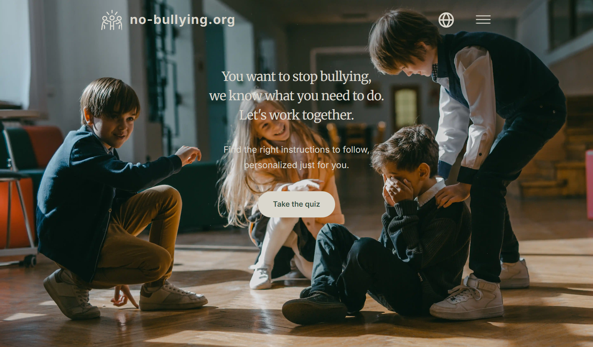

# no-bullying.org: Take the First Step ([View Live](https://no-bullying.org))



## Table of Contents

- [Overview](#overview)
  - [What is no-bullying.org?](#what-is-no-bullyingorg)
  - [Features](#features)
  - [Technology Stack](#technology-stack)
- [Development Process](#development-process)
  - [Purpose and Goals](#purpose-and-goals)
  - [Encountered Challenges](#encountered-challenges)
  - [What I Learned](#what-i-learned)
- [Author](#author)
- [License](#license)

## Overview

### What is no-bullying.org?

no-bullying.org is a **comprehensive web platform designed to help students, parents, and teachers understand, identify, and combat bullying**. The website provides educational resources about different types of bullying, their consequences, and most importantly, offers an interactive quiz that helps users identify their role in bullying environment and receive tailored advice to address their specific circumstances.

The platform implies a static multi-page website built with TypeScript and Next.js to ensure fast page load times and SEO using Static Site Generation (SSG). The website incorporates modern and responsive UI with calm/peaceful design personality adapted to mobile, tablet and desktop screens built using SCSS Modules for granular component-first styling.

### Features

- **🎯 Interactive Quiz** - A 26-question assessment system analyzing user responses to identify their role in bullying environment and detect violence patterns from both students and teachers by using scoring algorithms built using TypeScript and React Hooks.
- **🎨 Quote Carousel** - A responsive carousel React component featuring inspirational quotes from notable figures, complete with portrait imagery and smooth navigation controls built using useState React Hook for local state management.
- **🌍 Internationalization** - Route-based localization providing complete translations throughout the entire platform, including all educational content, quiz questions, results, and UI elements, making the website accessible both to English and Russian-speaking users.

### Technology Stack


## Development Process

### Purpose and Goals

My motivation for building this project stemmed from recognizing the serious impact that bullying has on students' mental health, academic performance, and overall wellbeing. According to research, 20.2% of students report being bullied, yet 41% believe the bullying will continue. I wanted to create a resource that not only educates but provides actionable guidance.

1. **📢 Raise Awareness**

   - Educate visitors about different types of bullying
   - Present factual statistics to highlight the prevalence and impact of bullying
   - Help people recognize bullying behaviors in various contexts

2. **🆘 Provide Personalized Support**

   - Identify users' role in bullying environment
   - Detect violence patterns from both students and teachers

3. **💪 Empower Action**

   - Deliver concrete, practical tips to prevent and stop bullying
   - Connect users with support resources and helplines

My goal was to learn how to **create a website that looks nice** and how to **deploy it to a shared hosting service**.

### Encountered Challenges

The initial version of the project used the traditional multi-page architecture with plain HTML for structure, SCSS for styling and TypeScript for interactivity. However, after I learnt Next.js, **I wanted to iterate on this project by migrating it to use the React component architecture** with JSX syntax and React Hooks, while keeping the website staticly rendered by using Next.js with Static Site Generation. **This would allow for more structured codebase and simpler maintenence by reducing code duplication through reusable React components**.

The migration process required a complete overhaul of the already existing logic and folder structure. **I had to rewrite the logic of each dynamic UI block to use React Hooks and collocate it with the styling by placing them under one folder to make up the component code**.

> [!NOTE]
> Check out the HTML version of the project by switching to the "html" branch of this repository.

### What I Learned

I learned a lot about **how to build reusable React components from scratch and use them to create beautiful responsive UIs**.

## Author

Designed and built by **Danil Dikhtyar** - Front-end developer creating modern websites / web applications.

**Connect with me:**

- 🌐 Portfolio: [dikhtyar.dev](https://dikhtyar.dev)
- 📫 Email: [contact@dikhtyar.dev](mailto:contact@dikhtyar.dev)
- 🐦 Twitter: [@Rock_n_Roll_CRC](https://x.com/Rock_n_Roll_CRC)

_Feel free to reach out for collaborations or questions about this project!_

## License

Copyright (c) 2025 Danil Dikhtyar. All rights reserved.

Licensed under the MIT License as stated in the [LICENSE](LICENSE):

```text
Copyright (c) 2025 Danil Dikhtyar

Permission is hereby granted, free of charge, to any person obtaining a copy
of this software and associated documentation files (the "Software"), to deal
in the Software without restriction, including without limitation the rights
to use, copy, modify, merge, publish, distribute, sublicense, and/or sell
copies of the Software, and to permit persons to whom the Software is
furnished to do so, subject to the following conditions:

The above copyright notice and this permission notice shall be included in all
copies or substantial portions of the Software.

THE SOFTWARE IS PROVIDED "AS IS", WITHOUT WARRANTY OF ANY KIND, EXPRESS OR
IMPLIED, INCLUDING BUT NOT LIMITED TO THE WARRANTIES OF MERCHANTABILITY,
FITNESS FOR A PARTICULAR PURPOSE AND NONINFRINGEMENT. IN NO EVENT SHALL THE
AUTHORS OR COPYRIGHT HOLDERS BE LIABLE FOR ANY CLAIM, DAMAGES OR OTHER
LIABILITY, WHETHER IN AN ACTION OF CONTRACT, TORT OR OTHERWISE, ARISING FROM,
OUT OF OR IN CONNECTION WITH THE SOFTWARE OR THE USE OR OTHER DEALINGS IN THE
SOFTWARE.
```
